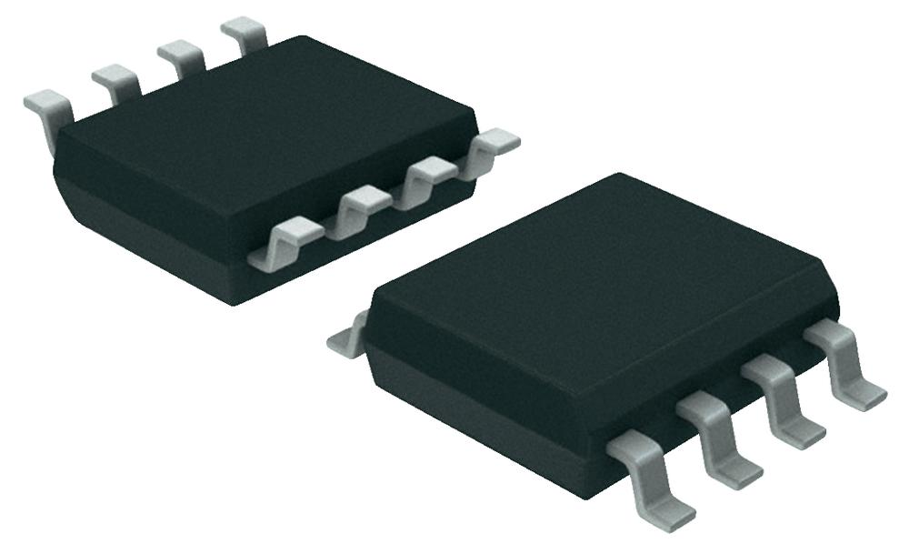
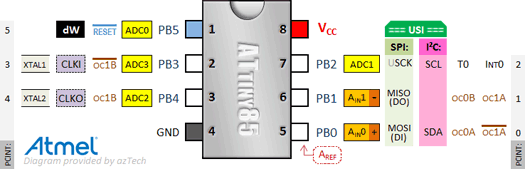
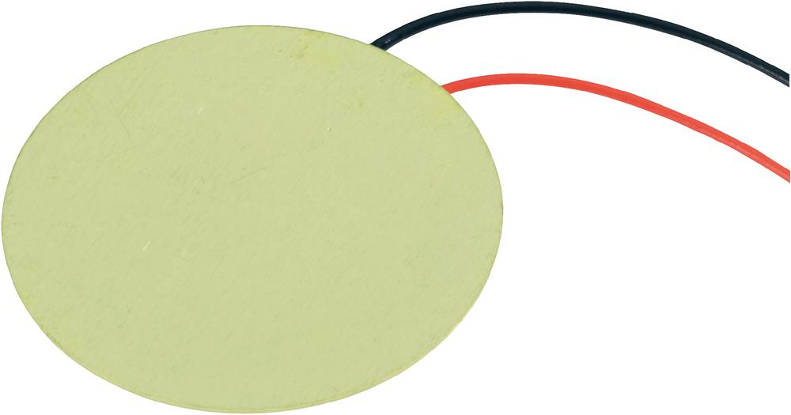
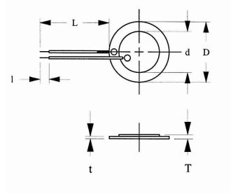
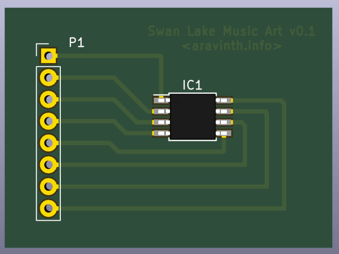
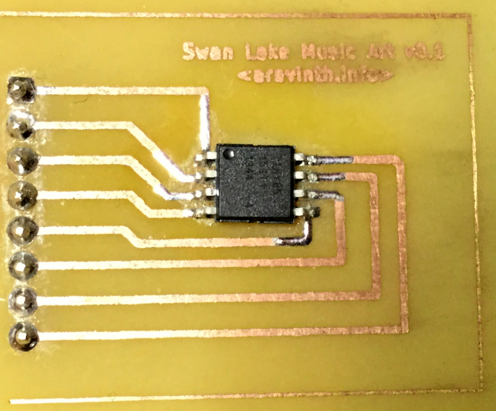

Swan Lake Music Art
=====================================

Swan Lake Music Art is a project of electronics and firmware to provide monotonic music for a multilayer painting about Russian Ballet which is painted by a fine artist who has been working on the project to exhibit the beauty of Ballet dance. Since the painting is on thinner canvas, the form factor of electronic should be thinner and smaller. Therefore a smaller microcontroller ATtiny85, Piezoceramic Element as speaker and Coincell Battery as power source are chosen.

AUTHOR
--------------------------------------
- Aravinth Panchadcharam <http://aravinth.info>

DESIGN
--------------------------------------
### Hardware
#### Atmel ATtiny85 Microcontroller [ [Datasheet](./docs/attiny85.pdf) ]
- ATTINY85-15ST1 SOIC-8
- 8 Bit AVR microcontroller with 16 MHz CPU
- 8 KB Flash, 512 Bytes RAM, 512 Bytes EEPROM 
- 8 MHz Internal Clock
- USI, PWM x 4, ADC x 4, WDT

#### Piezoceramic Element
- 4400 Hz
- Type : EPZ‑27MS44W 
- Dimension : (D x d x T x t) 27 x 20 x 0,53 x 0,25 mm 

#### Coincell Battery
#### Battery Holder

***

### PCB
Circuit board of the project is designed using KiCad. KiCad is an excellent opensource EDA tool available on various platforms. ATtiny85 is a very small microcontroller in SOIC-8 packaging. Furthermore component chosen in the projects are SMT which can be easily soldered to PCB with HotAir or SMD Reflow.

#### ATtiny85 Breakout 
First simple single layer breakout for the IC is designed and etched at home using Copper Clad, Toner Transfer Paper, Laser Print, Acetone and Iron(III) chloride. IC was soldered using HotAir gun of SMD Rework station. Pin headers with 2.54 mm pitch is soldered to it to develop with breadboard. 

*** 

### Music
The artist wants to use music of Tchaikovsky - Dance of the Little Swans from Swan Lake Op. 20. The difficult part (because no experience on synthesizing) of this project was to convert the music sheet to monotonic music notes that can be synthesized on 8 bit microcontroller. Solution from https://github.com/jarv/PlayTune was tried and however couldn't get the music right with it. This challenged me to learn deeply how music synthesis work and solved the problem as following,

- MIDI file from music sheet was found at https://www.8notes.com/scores/11419.asp
- Used [Musescore](https://musescore.org/en/2.0) software to convert MIDI into editable music sheet
- Cropped part of the music sheet that should be played in a loop
- Transcribed the lead notes (without chords) of music sheet by trial and error
- Played the notes on iPad Garageband to adjust note interval by ear
- Synthesized the notes on Arduino Uno with Tone library which generates key frequency using PWM 
- Learned [advanced music theory](https://en.wikipedia.org/wiki/Piano_key_frequencies) and about piano in twelve-tone equal temperament, with the 49th key, the fifth A (A4), tuned to 440 Hz
- Created a list of [piano key frequencies](./key_frequency.h) of 3rd to 5th octave and synthesized using Arduino Tone PWM
- Verified the correctness of tone frequency and timing using oscilloscope (RIGOL DS1054)
- With the help of all the above, finally transcribed and synthesized the right monotonic music of Swan Lake on Arduino

*** 

### Firmware
#### Development
Arduino platform officially supports only ATmega AVR microcontroller. In this project very small ATtiny85 microcontroller is used. Initially it was tried out to develop baremetal firmware using AVR GCC toolchain. Working samples ATtiny85 GCC projects are found in research folder. However, [ATTinyCore](https://github.com/SpenceKonde/ATTinyCore) by the community for Arduino platform does the work easily and can be installed in Arduino IDE via board manager. Dev version of firmware on Arduino can be directly flashed to ATtiny85 without reinventing the wheel because tone library implements music synthesizing using Timers/Interrupt of the microcontroller that generates PWM square wave. Finally Swan Lake music was synthesized on Arduino Uno and ATtiny85 by using the transcribed music notes and [piano key frequencies](./key_frequency.h).

#### Building, Wiring & Flashing
- Arduino Uno is flashed with ArduinoISP firmware (found in examples in Arduino IDE) to be used as ISP
- Connected 10uF ç between RESET and GND pin on Arduino to avoid rebooting while using as ISP
- PBO or Physical pin 5 of ATtiny85 is connected to the piezoceramic element
- [ATTinyCore](https://github.com/SpenceKonde/ATTinyCore) was installed in Arduino IDE via board manager
- On Arduino IDE Selected Board -> "ATtiny 25/45/85", Chip -> "ATtiny85", Clock -> "8 MHz Internal"
- Selected "Arduino as ISP" as programmer
- Connected Arduino Uno to ATtiny85 Breakout             
	- Arduino +5V       --->  ATtiny85 Pin 8 (VCC)
	- Arduino Ground    --->  ATtiny85 Pin 4 (GND)
	- Arduino Pin 10    --->  ATtiny85 Pin 1 (PB5 / RESET)
	- Arduino Pin 11    --->  ATtiny85 Pin 5 (PB0 / MOSI)
	- Arduino Pin 12    --->  ATtiny85 Pin 6 (PB1 / MISO)
	- Arduino Pin 13    --->  ATtiny85 Pin 7 (PB2 / SCL)
- Built and flashed to ATtiny85 by pressing upload button on Arduino IDE

